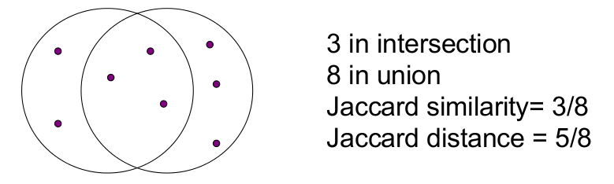
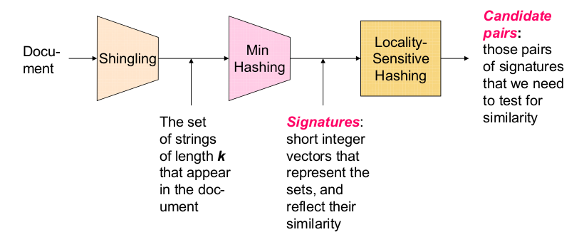
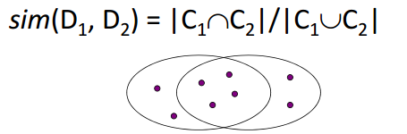
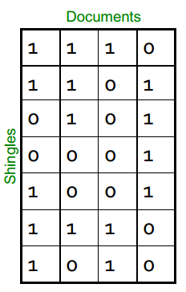
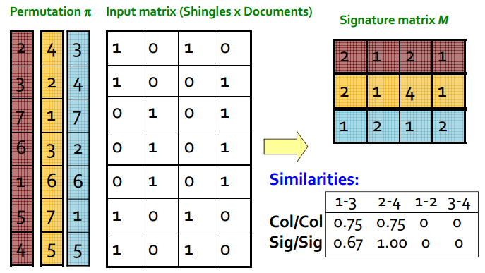

## Outline

 - Intro
 - Aplicaciones de búsqueda de NN
   - Similitud de documentos
   - Filtros colaborativos
 - Similitud de Jaccard en conjuntos
 - Shingling de documentos
 - Minhashing
 - Locality-Sensitive Hashing para documentos
 - Resumen

## Introducción I

Un problema fundamental de data mining es explorar datos en busca de items similares. 

- Un ejemplo sería ver una __colección de páginas web__ y encontrar páginas casi duplicadas.  
  - Estas páginas pueden ser __plagios__, por ejemplo, o podrían ser *__mirrors__* que tienen casi el mismo contenido pero difieren en información sobre el host y sobre otros  *__mirrors__*.

## Introducción II

Podemos ver el problema de la similitud como búsquedas en conjuntos con una intersección muy grande.

## High dimensional data

Muchos problemas pueden expresarse en términos de similitud de conjuntos:

 - Buscar vecinos cercanos en el espacio de alta D
 - Páginas con palabras similares
 - Para detección de duplicados, clasificación por temas
 - Clientes que compraron productos similares
 - Usuarios de NetFlix con gustos similares en películas
 - Productos que forman conjuntos de clientes similares
 - Imágenes con características similares.
 - Los usuarios que visitaron los sitios web similares

## Similitud de Jaccard en Conjuntos

 - Similitud de Jaccard
   - dados dos conjuntos  S y T: $sim(S,T) = \frac{|S \cap T|}{|S \cup T|}$

 - Distancia de Jaccard = 1 - Similitud de Jaccard
 

## Similitud de Documentos

__Objetivo:__ Dado un conjunto grande de documentos de textos (N ~ milllones), encontrar pares duplicados.

__Aplicaciones:__
 - Mirror websites, o aproximados MUY parecidos.
 	- No quiero que se muestren ambos documentos como resultado de una búsqueda.
  - Noticias similares en un portal de noticias.
  	- Agrupar noticias por "la misma historia".
  	
__Problemas:__

 - Muchas pequeñas piezas de un documento pueden aparecer fuera de orden en otro
 - Demasiados documentos para comparar todos los pares.
 - Los documentos son tan grandes o tantos que no caben en la memoria principal

## Pasos fundamentales para similitud de documentos

 1. __Shingling__: Convertir documentos a conjuntos
 2. __Min-Hashing__: Convertir GRANDES conjuntos en representaciones más cortas (signatures), preservando la similitud.
 3. __Locality-Sensitive Hashing__: Hace foco en pares de *signatures* que pueden provenir de documentos similares. 
 
Se termina encontrando los pares de candidatos para evaluar  con Jaccard.

## Bigpicture

## Documentos como datos de alta dimensionalidad

 - __Step 1:__ Shingling
 	- La IDEA: convertir documentos en conjuntos.
 - Abordaje Simple:
   - Documento = es un conjunto de palabras o un conjunto de palabras importantes. Esto no funcionaría bien. __¿Por qué?__
 - Es necesario explicar el orden de los términos.
 - __Solución__: Usar shingles!

## Shingling

Un __k-shingle__ (o __k-gram__) para un documento es una secuencia de k caracteres (o _tokens_ o fragmentos más grandes según la aplicación) que aparecen en el documento.

__Ejemplo__

 - Para un __k = 2__; y un documento __D1 = abcab__ 
 - Conjunto de __2-shingles__: 
 	$$S(D_1) = {ab, bc, ca}$$

## Compresión de Shingles

 - Podemos comprimir los shingles utilizando una función hash que convierta esos fragmentos a números. __4 bytes__
 - Y pasaríamos a representar el documento  utilizando conjuntos de valores de hash de los k-shingles
 	- __Idea:__ Dos documentos (raramente) podrían tener _shingles_ en común, cuando en realidad solo se compartieron los valores hash.
 - Ejemplo: 
 	- k=2; documento D1= abcab 
 	- conjunto de 2-shingles: _S(D1) = {ab, bc, ca}_
 	- Hash los singles: _h(D1) = {1, 5, 7}_

## Métricas de similaridad en shingles
 - El documento D1 es un conjunto de sus __k-shingles__ C1=S(D1)
 - Equivalentemente cada uno de los documentos es un vector 0/1 en el espacio de k-shingles
 	- Cada único shingle es una dimensión
 	- Los vectores son muy ralos
 - Una medida natural de similaridad es Jaccard:  

## Supuestos del trabajo

- Los documentos que tienen muchos Shingles en común tienen textos similares, aún si el texto aparece en un orden diferente.
 - __Precaución__: Se debería elegir un k lo suficientemente grande o la mayoría de los documentos tendrán todos los shingles.
 	- __k = 5__ es OK para documentos cortos.
 	- __k = 10__ es mejor para documentos largos.

##  Motivaciones Minhash/LSH

- <h6>Supongamos que necesitamos buscar duplicados en _N = 1 millón de documentos._</h6>
- La solución Naïve sería hacer la comparación de a pares con __similitud de jaccard__
  - N(N - 1)/2 ≈ 5\*1011 comparaciones
  - Tenemos 105 sec/díá y 106 comparaciones/sec, tomaría 5 días.
  - Para __N = 10__ millones esto tomaríá mas de un año...

## Minhashing

- **Step 2:** __Minhashing__: Convertir grandes conjuntos en firmas cortas conservando la similitud.

## Codificar conjuntos como vectores de bits

- Muchos problemas de evaluación de similitud se pueden formalizar búsquedas de  subconjuntos que tienen una intersección significativa.
- Codificar conjuntos con 0/1 (bit, boolean) vectors
	- Una dimensión por elemento en el conjunto universal
- Interpretar el conjunto intersección como bitwise AND y el conjunto unión como bitwise OR.
- Ejemplo: C1 = 10111; C2 = 10011
	- Tamaño de la intersección = 3; tamaño de la unión = 4,
	- Jaccard similarity = 3/4
	- Distance: d(C1,C2) = 1 – (Jaccard similarity) = 1/4

## De conjuntos a Matrices

 - Cada documento es una columna y cada fila un shingle
 - Se calcula Jaccard solo para los 1
 - Típica matriz rala (Término/Documento)
 

## Procedimiento
__Objetivo__: Buscar columnas similares, con pequeñas _signatures_.

Aproximación Naïve:
 
 1. Signatures de columnas: pequeños resumenes de columnas.
 2. Examinar pares de signatures para buscar columnas similares.
     - Esencial: similitudes de firmas y columnas están relacionadas
 3. __Opcional__: Verificar que las columnas con igual _signature_ son realmente similares.
 
__Warnings:__
Comparar todos los pares puede ser mucho tiempo: Trabajo para LSH!!
 - Estos métodos pueden producir false negatives e incluso false positives (si se omite 3)

## Minhashing: Ejemplo con permutaciones

## Find similar columns, Small signatures

 Aproximación Naïve:
 
 1. _Signatures_ de columnas: Son pequeños resúmenes de columnas.
 2. Examinar pares de _signatures_ para buscar columnas similares.
    __Importante__: Las similitudes de _signatures_ y de columnas están relacionadas.
 3. __Opcional__: Verificar que las columnas con _signatures_ similares son realmente similares.

 __Warnings__: Comparar todos los pares puede tomar mucho tiempo: Trabajo para LSH. 
  
   - Estos métodos pueden producir falsos negativos y a menudo falsos  positivos (si la verificación opcional no es realizada).

## Locality-Sensitive Hashing

__Step 3:__ Locality-Sensitive Hashing:

Hace foco en pares de _signatures_ que son probables de ser documentos similares.

## Entendiendo LSH

__Goal:__ Find documents with Jaccard similarity at least s (for some similarity threshold, e.g., s=0.8)

__LSH – General idea:__ Use a function f(x,y) that tells whether x and y is a candidate pair: a pair of elements whose similarity must be evaluated.

__For Min-Hash matrices:__

 - Hash columns of signature matrix M to many buckets.
 - Each pair of documents that hashes into the same bucket is a __candidate pair__.

## Candidatos desde Min-Hash

 - Pick a similarity threshold s(0 < s < 1)
 - Columns __x__ and __y__ of __M__ are a candidate pair if their signatures agree on at least fraction s of their rows:

    __M(i, x) = M(i, y)__ for at least frac. s values of i

 - We expect documents x and y to have the same (Jaccard) similarity as their signatures.

## LSH para Minhashing signatures

 - __Big idea__: Hash columns of signature matrix M several times
 - Arrange that (only) similar columns are likely to hash to the same bucket, with high probability.
 - Candidate pairs are those that hash to the same bucket
 - Los pares de candidatos son todos aquellos que fueron _hasheados_ en el mismo bucket.
 - Solo se verifica la similitud de los __pares de candidatos__

 Lo esperable es que los hash que son diferentes __nunca__ caigan en el mismo bucket

